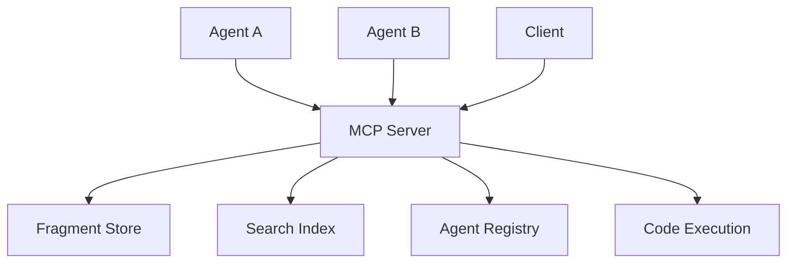

# 03 - Installation and Setup

**Comprehensive guide to installing, configuring, and getting started with Quaid**

---

## Overview

Quaid is designed to be easy to install and set up with multiple installation options to suit different environments and preferences. This guide covers everything from basic installation to advanced configuration and integration with popular development tools.

---

## System Requirements

### Minimum Requirements
- **Python**: 3.8 or higher
- **Operating System**: macOS, Linux, Windows (WSL2 recommended)
- **RAM**: 500MB minimum (1GB recommended)
- **Disk Space**: 100MB minimum (250MB recommended for full features)
- **Git**: Required for version control features

### Recommended Requirements
- **Python**: 3.10 or higher
- **RAM**: 1GB or higher
- **Disk Space**: 500MB or higher
- **CPU**: Multi-core processor for better performance

### Optional Requirements
- **Typer**: For rich CLI with automatic help and validation (auto-installed)
- **uv**: For project management, building, and deployment

---

## Installation Methods

### Method 1: Package Manager Installation (Recommended)

#### Via uv (Recommended)

```bash
# Install using uv (fast and modern Python package manager)
uv add quaid

# Or install with specific features
uv add "quaid[graph]"       # Include NetworkX graph features
uv add "quaid[graph-viz]"   # Include graph visualization (requires Graphviz)
uv add "quaid[ai]"          # Include local AI reranking features
uv add "quaid[all]"         # Include all optional dependencies
```

#### Via pip (Python Package Index)

```bash
# Install the latest stable version
pip install quaid

# Or install with specific features
pip install "quaid[graph]"       # Include NetworkX graph features
pip install "quaid[graph-viz]"   # Include graph visualization (requires Graphviz)
pip install "quaid[ai]"          # Include local AI reranking features
pip install "quaid[all]"         # Include all optional dependencies
```

#### Via Conda/Mamba

```bash
# Install from conda-forge
conda install -c conda-forge quaid

# Or with mamba for faster downloads
mamba install -c conda-forge quaid
```

#### Via Homebrew (macOS)

```bash
# Install via Homebrew
brew install quaid

# Upgrade existing installation
brew upgrade quaid
```

### Method 2: Source Installation with uv

#### Development Installation (Recommended)

```bash
# Clone the repository
git clone https://github.com/quaid-org/quaid.git
cd quaid

# Use uv for fast dependency management
uv sync

# Or for development dependencies
uv sync --dev

# Run in development mode
uv run quaid --version
```

#### Production Installation from Source

```bash
# Clone stable release
git clone --branch stable https://github.com/quaid-org/quaid.git
cd quaid

# Build and install with uv
uv build
uv pip install dist/*.whl
```

### Method 3: Traditional Source Installation

#### Development Installation

```bash
# Clone the repository
git clone https://github.com/quaid-org/quaid.git
cd quaid

# Create virtual environment (recommended)
python -m venv venv
source venv/bin/activate  # On Windows: venv\Scripts\activate

# Install in development mode
pip install -e ".[dev]"

# Install pre-commit hooks
pre-commit install
```

#### Production Installation from Source

```bash
# Clone stable release
git clone --branch stable https://github.com/quaid-org/quaid.git
cd quaid

# Build and install
pip install .
```

---

## Project Management with uv

Quaid uses **uv** as the recommended tool for project management, dependency management, building, and deployment. uv provides significantly faster performance and modern Python project management capabilities.

### Key Benefits of uv

- **10-100x Faster**: Blazing fast dependency resolution and installation
- **Modern Project Management**: Built-in support for pyproject.toml and workspaces
- **Reliable Locking**: Deterministic dependency resolution with lockfiles
- **Cross-Platform**: Works consistently across macOS, Linux, and Windows
- **Development Tools**: Integrated tool running and script management

### Common uv Commands for Quaid

```bash
# Initialize a new Quaid project with uv
uv init my-quaid-project
cd my-quaid-project
uv add quaid

# Add dependencies
uv add "quaid[all]"           # Install with all features
uv add fastmcp              # Add MCP server framework
uv add python-prompt-toolkit # Add interactive prompts

# Run Quaid commands
uv run quaid init
uv run quaid serve

# Development workflow
uv sync --dev                # Install development dependencies
uv run python -m pytest     # Run tests
uv run python -m quaid build # Build project

# Build and deployment
uv build                     # Build wheel and sdist
uv publish                    # Publish to PyPI (if needed)
```

### Project Structure with uv

```
my-quaid-project/
├── pyproject.toml           # Project configuration
├── uv.lock                  # Dependency lockfile
├── .python-version          # Python version specification
├── src/                     # Source code
└── .quaid/                  # Quaid project data
```

### pyproject.toml Example

```toml
[project]
name = "my-quaid-project"
version = "0.1.0"
dependencies = [
    "quaid>=1.0.0",
    "fastmcp",
    "typer",
    "networkx>=3.2",               # Graph algorithms and analysis
    "polars>=0.20",                 # High-performance dataframes
    "tantivy>=0.20",                # Full-text search engine
    "spacy>=3.7",                   # Natural language processing
    "markdown-query>=0.1",          # Structural markdown parsing
    "textual>=0.44"                 # TUI framework
]

[project.optional-dependencies]
dev = [
    "pytest",
    "pytest-cov",
    "pytest-asyncio",
    "pytest-mock",
    "ruff",
    "poethepoet",
    "pre-commit"
]

docs = [
    "mkdocs",
    "mkdocs-material",
    "mkdocs-mermaid2-plugin",
    "mkdocs-git-revision-date-localized-plugin"
]

graph = [
    "python-louvain>=0.16",         # Community detection
    "matplotlib>=3.8",              # Graph visualization
    "pillow>=10.0"                  # Image processing for exports
]

graph-viz = [
    "graphviz>=0.20",               # Graphviz integration (requires system Graphviz)
    "python-louvain>=0.16",
    "matplotlib>=3.8",
    "pillow>=10.0"
]

ai = [
    "flash-rank>=0.2",              # Cross-encoder reranking for local AI
]

all = [
    "quaid[dev,docs,graph,ai]"
]

[tool.uv]
dev-dependencies = [
    "pytest>=8.0.0",
    "pytest-cov>=4.0.0",
    "pytest-asyncio>=0.21.0",
    "pytest-mock>=3.10.0",
    "ruff>=0.1.0",
    "poethepoet>=0.25.0",
    "pre-commit>=3.0.0"
]

docs-dependencies = [
    "mkdocs>=1.5.0",
    "mkdocs-material>=9.4.0",
    "mkdocs-mermaid2-plugin>=1.1.0",
    "mkdocs-git-revision-date-localized-plugin>=1.2.0"
]

[tool.ruff]
line-length = 88
target-version = "py38"

[tool.ruff.lint]
select = ["E", "F", "W", "I", "N", "B", "C4", "UP"]
ignore = ["E501"]  # Line too long (handled by formatter)

[tool.ruff.format]
quote-style = "double"
indent-style = "space"

# Poe the Poet task runner configuration
[tool.poe.tasks]
# Development tasks
test = "pytest --cov=src --cov-report=html --cov-report=term-missing"
test-unit = "pytest tests/unit"
test-integration = "pytest tests/integration"
test-e2e = "pytest tests/e2e"
test-watch = "pytest --watch --cov=src"

lint = "ruff check ."
format = "ruff format ."
lint-fix = "ruff check . --fix && ruff format ."

# Coverage tasks
coverage = "pytest --cov=src --cov-report=html"
coverage-report = "open htmlcov/index.html"

# Documentation tasks
docs-serve = "mkdocs serve"
docs-build = "mkdocs build"
docs-deploy = "mkdocs gh-deploy"

# Quaid specific tasks
init = "quaid init"
serve = "quaid serve"
build = "quaid build"

# Composite tasks
check = ["lint", "test"]
check-all = ["lint", "test-unit", "test-integration", "test-e2e"]
dev = ["format", "lint-fix", "test"]
ci = ["format", "lint-fix", "test-all"]
docs = ["docs-build", "docs-serve"]

# Task with help and arguments
[tool.poe.tasks.serve-dev]
help = "Start Quaid MCP server in development mode"
cmd = "quaid serve --debug --reload"
args = [
    {name = "host", options = ["--host", "-h"], default = "localhost"},
    {name = "port", options = ["--port", "-p"], default = "8080", type = "int"}
]

# Complex task with environment variables
[tool.poe.tasks.import-data]
help = "Import data from external sources"
shell = """
quaid import --source $SOURCE --format $FORMAT --validate
echo "Import completed from $SOURCE"
"""
env = {SOURCE = "default.csv", FORMAT = "csv"}

[build-system]
requires = ["hatchling"]
build-backend = "hatchling.build"
```

### Linting and Formatting with Ruff

Quaid uses **Ruff** for both linting and formatting. Ruff provides extremely fast performance (10-100x faster than traditional tools) while maintaining compatibility with established standards.

#### Common Ruff Commands

```bash
# Check code for linting issues
uv run ruff check .

# Format code
uv run ruff format .

# Check and format in one command
uv run ruff check . --fix
uv run ruff format .

# Check specific files
uv run ruff check src/quaid/

# Show detailed rule information
uv run ruff rule E501

# Configuration validation
uv run ruff check --show-settings
```

#### Ruff Configuration for Quaid

- **Line Length**: 88 characters (Python standard)
- **Target Version**: Python 3.8+
- **Rules**: Extended set including error checking, formatting, imports, naming, and code quality
- **Format Style**: Double quotes, space indentation
- **Performance**: Blazing fast - checks entire codebase in milliseconds

#### Integration with uv

Ruff integrates seamlessly with uv for optimal development workflow:

```bash
# Setup development environment
uv sync --dev

# Development cycle
uv run ruff check . --fix    # Fix linting issues
uv run ruff format .         # Format code
uv run pytest               # Run tests
```

---

## Task Running with Poe the Poet

Quaid uses **Poe the Poet** as the task runner for defining and executing project tasks. Poe provides a simple, powerful way to manage development workflows directly from `pyproject.toml`.

### Key Benefits of Poe

- **Simple Configuration**: Define tasks in `pyproject.toml` with clear syntax
- **uv Integration**: Automatically uses uv's virtual environment
- **Shell Completion**: Tab completion for task names and options
- **Flexible Tasks**: Support for commands, shell scripts, Python functions
- **Self-Documenting**: Tasks include help messages and are discoverable
- **Composite Tasks**: Combine multiple tasks into workflows

### Installation

```bash
# Install globally with pipx (recommended)
pipx install poethepoet

# Or install as project dependency
uv add --dev poethepoet
```

### Common Poe Commands

```bash
# List all available tasks
poe

# Run a specific task
poe test

# Run task with arguments
poe serve-dev --host 0.0.0.0 --port 9000

# Run composite task (executes multiple tasks)
poe check        # Runs lint then test
poe dev          # Runs format, lint-fix, then test

# Get help for a specific task
poe --help serve-dev

# Run from different directory
poe -C /path/to/project test
```

### Task Types

#### Simple Command Tasks
```toml
[tool.poe.tasks]
test = "pytest --cov=src"
lint = "ruff check ."
format = "ruff format ."
```

#### Tasks with Arguments
```toml
[tool.poe.tasks.serve]
help = "Start Quaid MCP server"
cmd = "quaid serve"
args = [
    {name = "host", options = ["--host", "-h"], default = "localhost"},
    {name = "port", options = ["--port", "-p"], default = "8080", type = "int"}
]
```

#### Shell Script Tasks
```toml
[tool.poe.tasks.deploy]
help = "Deploy Quaid to production"
shell = """
echo "Building project..."
uv build
echo "Deploying to production..."
quaid deploy --env production
echo "Deployment complete!"
"""
```

#### Composite Tasks
```toml
[tool.poe.tasks]
check = ["lint", "test"]           # Run lint then test
ci = ["format", "lint-fix", "test", "build"]  # Full CI pipeline
```

#### Environment Variable Tasks
```toml
[tool.poe.tasks.backup]
help = "Backup Quaid data"
shell = "quaid backup --output $BACKUP_DIR"
env = {BACKUP_DIR = "./backups"}
```

### Example Quaid Development Workflow

```bash
# 1. Setup project
uv init my-quaid-project
cd my-quaid-project
uv add quaid fastmcp poethepoet

# 2. Initialize Quaid
poe init

# 3. Start development server
poe serve-dev

# 4. Run tests during development
poe test

# 5. Check code quality before committing
poe check

# 6. Full development cycle
poe dev     # Formats, fixes linting, runs tests
```

### Poe with uv Integration

Poe automatically detects and uses uv's virtual environment, making it seamless:

```bash
# These are equivalent - Poe automatically finds uv's environment
poe test
uv run pytest

# Poe can also run uv commands
poe sync        # Runs uv sync
poe run test    # Runs uv run pytest
```

This provides a unified task running experience that works perfectly with Quaid's local-first, easy-to-use philosophy.

---

## Git Hooks with Pre-commit

Quaid uses **Pre-commit** for managing Git hooks that automatically check code quality before every commit. Pre-commit ensures code consistency and catches issues early, making code reviews more productive.

### Key Benefits of Pre-commit

- **Multi-language Support**: Run hooks written in any language without manual installation
- **Automatic Environment Management**: Downloads and builds tools as needed (no root access required)
- **Consistent Code Quality**: Enforces the same standards across all developers
- **Fast Execution**: Runs only on changed files for quick feedback
- **Easy Configuration**: Simple YAML configuration with hundreds of available hooks

### Installation

```bash
# Install as project dependency
uv add --dev pre-commit

# Or install globally
pip install pre-commit
```

### Configuration

Create `.pre-commit-config.yaml` in your project root:

```yaml
# .pre-commit-config.yaml
repos:
  # Basic file checks
  - repo: https://github.com/pre-commit/pre-commit-hooks
    rev: v4.5.0
    hooks:
      - id: trailing-whitespace
      - id: end-of-file-fixer
      - id: check-yaml
      - id: check-added-large-files
      - id: check-merge-conflict
      - id: check-toml

  # Python formatting with Ruff
  - repo: https://github.com/astral-sh/ruff-pre-commit
    rev: v0.1.0
    hooks:
      - id: ruff
        args: [--fix, --exit-non-zero-on-fix]
      - id: ruff-format

  # Security checks
  - repo: https://github.com/PyCQA/bandit
    rev: 1.7.5
    hooks:
      - id: bandit
        args: [-c, pyproject.toml]
        additional_dependencies: ["bandit[toml]"]

  # Type checking
  - repo: https://github.com/pre-commit/mirrors-mypy
    rev: v1.7.1
    hooks:
      - id: mypy
        additional_dependencies: [types-all]

  # Documentation checks
  - repo: https://github.com/pycqa/pydocstyle
    rev: 6.3.0
    hooks:
      - id: pydocstyle
        args: [--convention=google]
```

### Setup Commands

```bash
# Install pre-commit hooks in your repository
pre-commit install

# Install hooks for commit-msg and pre-push as well
pre-commit install --hook-type commit-msg --hook-type pre-push

# Run all hooks on all files (useful for initial setup)
pre-commit run --all-files

# Update hooks to latest versions
pre-commit autoupdate

# Run specific hook
pre-commit run ruff
```

### Pre-commit Integration with uv and Poe

Pre-commit works seamlessly with your existing development tools:

```bash
# Development workflow with pre-commit
uv sync --dev        # Install dependencies
poe format          # Format code with Ruff
git add .
git commit          # Pre-commit runs automatically
```

### Common Pre-commit Hooks for Quaid

#### Python Code Quality
```yaml
- repo: https://github.com/astral-sh/ruff-pre-commit
  rev: v0.1.0
  hooks:
    - id: ruff          # Linting
    - id: ruff-format   # Formatting
```

#### Security Checks
```yaml
- repo: https://github.com/PyCQA/bandit
    rev: 1.7.5
    hooks:
      - id: bandit
        exclude: ^tests/
```

#### Documentation
```yaml
- repo: https://github.com/pycqa/pydocstyle
    rev: 6.3.0
    hooks:
      - id: pydocstyle
        files: ^src/
```

#### Commit Message Standards
```yaml
- repo: https://github.com/commitizen-tools/commitizen
    rev: 3.10.0
    hooks:
      - id: commitizen
        stages: [commit-msg]
```

### Example Pre-commit Workflow

```bash
# 1. Make changes to your code
# Edit files...

# 2. Stage your changes
git add .

# 3. Commit - pre-commit runs automatically
git commit -m "feat: add memory fragment search"

# Pre-commit output:
# ruff.........................................................Passed
# ruff-format...................................................Passed
# bandit.........................................................Passed
# trailing-whitespace...........................................Passed
# [main abc1234] feat: add memory fragment search
#  2 files changed, 15 insertions(+)
```

### Benefits for Quaid Projects

- **Code Consistency**: All code follows the same formatting and quality standards
- **Automated Quality Gates**: Catches issues before they reach code review
- **Developer Experience**: Fast feedback loop during development
- **Team Collaboration**: Ensures everyone follows the same standards
- **Zero Configuration**: Works out of the box with sensible defaults

Pre-commit ensures that every commit to your Quaid project meets quality standards, making development more efficient and code reviews more focused on architecture and logic rather than style issues.

---

## Testing with Pytest

Quaid uses **pytest** as the testing framework for unit tests, integration tests, and end-to-end (E2E) tests. Pytest provides a simple, powerful testing experience with excellent plugin ecosystem.

### Key Benefits of Pytest

- **Simple Syntax**: Write tests with plain `assert` statements
- **Rich Plugin Ecosystem**: Coverage, async testing, mocking, and more
- **Detailed Output**: Clear failure messages and test reports
- **Fixtures**: Powerful dependency injection for test setup
- **Parametrization**: Run tests with multiple input combinations
- **Markers**: Organize and selectively run tests

### Pytest Plugins

Quaid includes these essential pytest plugins:

- **pytest-cov**: Coverage reporting
- **pytest-asyncio**: Async test support
- **pytest-mock**: Mocking and patching
- **pytest-watch**: Continuous testing

### Test Structure

```
tests/
├── unit/                    # Unit tests
│   ├── test_fragments.py
│   ├── test_search.py
│   └── test_agents.py
├── integration/             # Integration tests
│   ├── test_mcp_server.py
│   ├── test_tantivy.py
│   └── test_filelock.py
├── e2e/                     # End-to-end tests
│   ├── test_full_workflow.py
│   └── test_multi_agent.py
├── conftest.py              # Shared fixtures and configuration
└── pytest.ini               # Pytest configuration
```

### Configuration

Create `pytest.ini` in your project root:

```ini
[tool:pytest]
testpaths = tests
python_files = test_*.py
python_classes = Test*
python_functions = test_*
addopts =
    --strict-markers
    --strict-config
    --verbose
    --tb=short
    --cov=src
    --cov-report=html
    --cov-report=term-missing
    --cov-fail-under=80
markers =
    unit: Unit tests
    integration: Integration tests
    e2e: End-to-end tests
    slow: Slow running tests
    network: Tests that require network access
asyncio_mode = auto
```

### Common Test Patterns

#### Unit Tests
```python
# tests/unit/test_fragments.py
import pytest
from quaid.fragments import FragmentManager

class TestFragmentManager:
    def test_create_fragment_basic(self):
        """Test basic fragment creation"""
        manager = FragmentManager()
        fragment = manager.create(
            content="# Test Fragment\n\nThis is a test.",
            fragment_type="test"
        )

        assert fragment.id is not None
        assert fragment.type == "test"
        assert "Test Fragment" in fragment.content

    @pytest.mark.parametrize("fragment_type,expected", [
        ("decision", "decision"),
        ("implementation", "implementation"),
        ("note", "general")
    ])
    def test_create_fragment_types(self, fragment_type, expected):
        """Test fragment creation with different types"""
        manager = FragmentManager()
        fragment = manager.create(
            content="Test content",
            fragment_type=fragment_type
        )

        assert fragment.type == expected

    def test_fragment_validation(self):
        """Test fragment validation"""
        manager = FragmentManager()

        with pytest.raises(ValueError, match="Content cannot be empty"):
            manager.create(content="", fragment_type="test")
```

#### Integration Tests
```python
# tests/integration/test_mcp_server.py
import pytest
from quaid.mcp_server import QuaidMCPServer

@pytest.mark.integration
class TestMCPServer:
    async def test_server_startup(self):
        """Test MCP server starts correctly"""
        server = QuaidMCPServer()
        await server.start()

        # Server should be running
        assert server.is_running()

        await server.stop()

    async def test_fragment_creation_via_mcp(self):
        """Test fragment creation through MCP interface"""
        server = QuaidMCPServer()
        await server.start()

        # Create fragment via MCP call
        result = await server.call_tool(
            "create_fragment",
            {
                "content": "# Test\n\nCreated via MCP",
                "fragment_type": "test"
            }
        )

        assert result["fragment_id"] is not None
        assert result["success"] is True

        await server.stop()
```

#### E2E Tests
```python
# tests/e2e/test_full_workflow.py
import pytest
from quaid import Quaid

@pytest.mark.e2e
@pytest.mark.slow
class TestFullWorkflow:
    def test_complete_memory_management_workflow(self):
        """Test complete workflow from init to search"""
        # 1. Initialize project
        quaid = Quaid()
        quaid.init()

        # 2. Create fragments
        fragment1 = quaid.create_fragment(
            content="# Decision\n\nUse PostgreSQL for database",
            fragment_type="decision"
        )

        fragment2 = quaid.create_fragment(
            content="# Implementation\n\nSet up PostgreSQL connection",
            fragment_type="implementation"
        )

        # 3. Search fragments
        results = quaid.search("PostgreSQL")
        assert len(results) >= 2

        # 4. Verify relationship detection
        related = quaid.find_related_fragments(fragment1.id)
        assert any(f["id"] == fragment2.id for f in related)
```

#### Async Tests
```python
# tests/unit/test_async_operations.py
import pytest
from quaid.async_search import AsyncSearchEngine

@pytest.mark.asyncio
class TestAsyncSearch:
    async def test_async_search(self):
        """Test async search functionality"""
        engine = AsyncSearchEngine()

        results = await engine.search("test query")
        assert isinstance(results, list)

    async def test_concurrent_searches(self):
        """Test multiple concurrent searches"""
        engine = AsyncSearchEngine()

        queries = ["query1", "query2", "query3"]
        tasks = [engine.search(q) for q in queries]

        results = await asyncio.gather(*tasks)
        assert len(results) == 3
```

#### Mock Tests
```python
# tests/unit/test_with_mocks.py
import pytest
from unittest.mock import Mock, patch
from quaid.external_service import ExternalAPIClient

class TestExternalIntegration:
    @patch('quaid.external_service.requests.get')
    def test_external_api_call(self, mock_get):
        """Test external API integration with mocked response"""
        mock_get.return_value.json.return_value = {"status": "success"}

        client = ExternalAPIClient()
        result = client.fetch_data()

        assert result["status"] == "success"
        mock_get.assert_called_once()

    def test_with_mock_object(self):
        """Test using mock objects"""
        mock_service = Mock()
        mock_service.process.return_value = "processed"

        from quaid.processor import Processor
        processor = Processor(service=mock_service)

        result = processor.handle_data("test data")

        assert result == "processed"
        mock_service.process.assert_called_once_with("test data")
```

### Fixtures

```python
# tests/conftest.py
import pytest
import tempfile
from pathlib import Path
from quaid import Quaid

@pytest.fixture
def temp_project():
    """Create a temporary Quaid project"""
    with tempfile.TemporaryDirectory() as temp_dir:
        project_path = Path(temp_dir)
        quaid = Quaid(project_path)
        quaid.init()
        yield quaid

@pytest.fixture
def sample_fragments(temp_project):
    """Create sample fragments for testing"""
    fragments = []

    fragments.append(temp_project.create_fragment(
        content="# Decision\n\nUse async/await pattern",
        fragment_type="decision",
        tags=["python", "async"]
    ))

    fragments.append(temp_project.create_fragment(
        content="# Implementation\n\nAsync database queries",
        fragment_type="implementation",
        tags=["python", "database", "async"]
    ))

    return fragments

@pytest.fixture
def mock_search_engine():
    """Mock search engine for testing"""
    from unittest.mock import Mock
    engine = Mock()
    engine.search.return_value = [
        {"id": "1", "content": "test result 1"},
        {"id": "2", "content": "test result 2"}
    ]
    return engine
```

### Running Tests

```bash
# Run all tests
poe test

# Run specific test categories
poe test-unit          # Unit tests only
poe test-integration   # Integration tests only
poe test-e2e          # E2E tests only

# Run with coverage
poe coverage

# Run specific test file
pytest tests/unit/test_fragments.py

# Run specific test function
pytest tests/unit/test_fragments.py::TestFragmentManager::test_create_fragment_basic

# Run tests with specific markers
pytest -m "unit and not slow"

# Run tests in watch mode (continuous testing)
poe test-watch

# Run tests with verbose output
pytest -v

# Stop on first failure
pytest -x

# Show local variables in tracebacks
pytest --tb=long

# Run tests with specific Python version
python3.11 -m pytest
```

### Coverage Reporting

```bash
# Generate coverage report
poe coverage

# Open HTML coverage report
poe coverage-report

# Set coverage threshold
pytest --cov=src --cov-fail-under=80

# Exclude files from coverage
pytest --cov=src --cov-omit="*/tests/*"
```

### Testing Best Practices

1. **Arrange-Act-Assert Pattern**: Structure tests clearly
2. **Descriptive Names**: Test names should describe what they test
3. **One Assertion Per Test**: Focus on testing one thing
4. **Use Fixtures**: Reuse setup code across tests
5. **Mock External Dependencies**: Isolate code from external services
6. **Test Edge Cases**: Test error conditions and boundary cases
7. **Parametrize Tests**: Test multiple input combinations
8. **Use Markers**: Organize tests by type and characteristics

### Integration with Development Tools

Pytest integrates seamlessly with your development workflow:

```bash
# Development cycle with testing
poe format          # Format code
poe lint-fix        # Fix linting issues
poe test            # Run tests
git add .
git commit         # Pre-commit runs tests automatically
```

Pytest ensures that your Quaid project maintains high code quality and reliability through comprehensive testing at all levels.

---

## Documentation with MkDocs

Quaid uses **MkDocs** for generating a beautiful, fast documentation website for the MCP server. MkDocs creates static sites from Markdown files with a clean, searchable interface.

### Key Benefits of MkDocs

- **Simple Markdown**: Write documentation in plain Markdown
- **Fast Static Sites**: Generates static HTML sites that are extremely fast
- **Beautiful Themes**: Professional-looking documentation with Material for MkDocs
- **Search Functionality**: Built-in search across all documentation
- **Version Control**: Documentation lives alongside code in Git
- **Easy Deployment**: Simple deployment to GitHub Pages or other static hosting
- **Plugin Ecosystem**: Rich plugin ecosystem for diagrams, git integration, and more

### MkDocs Plugins

Quaid includes these essential MkDocs plugins:

- **mkdocs-material**: Material Design theme for beautiful documentation
- **mkdocs-mermaid2-plugin**: Support for Mermaid diagrams and flowcharts
- **mkdocs-git-revision-date-localized-plugin**: Git integration and version tracking

### Documentation Structure

```
docs/
├── index.md                 # Homepage
├── getting-started/
│   ├── installation.md
│   ├── quick-start.md
│   └── configuration.md
├── user-guide/
│   ├── fragments.md
│   ├── search.md
│   ├── mcp-server.md
│   └── multi-agent.md
├── developer-guide/
│   ├── architecture.md
│   ├── contributing.md
│   ├── testing.md
│   └── deployment.md
├── api/
│   ├── overview.md
│   ├── fragments.md
│   ├── search.md
│   └── agents.md
├── examples/
│   ├── basic-usage.md
│   ├── multi-agent-setup.md
│   └── custom-integration.md
├── mkdocs.yml             # MkDocs configuration
└── requirements.txt        # Documentation dependencies
```

### Configuration

Create `mkdocs.yml` in your project root:

```yaml
site_name: Quaid MCP Server
site_description: AI-powered memory management system for multi-agent coordination
site_author: Quaid Team
site_url: https://yourusername.github.io/quaid

# Repository
repo_name: yourusername/quaid
repo_url: https://github.com/yourusername/quaid
edit_uri: edit/main/docs/

# Navigation
nav:
  - Home: index.md
  - Getting Started:
      - Installation: getting-started/installation.md
      - Quick Start: getting-started/quick-start.md
      - Configuration: getting-started/configuration.md
  - User Guide:
      - Fragments: user-guide/fragments.md
      - Search: user-guide/search.md
      - MCP Server: user-guide/mcp-server.md
      - Multi-Agent: user-guide/multi-agent.md
  - Developer Guide:
      - Architecture: developer-guide/architecture.md
      - Contributing: developer-guide/contributing.md
      - Testing: developer-guide/testing.md
      - Deployment: developer-guide/deployment.md
  - API Reference:
      - Overview: api/overview.md
      - Fragments API: api/fragments.md
      - Search API: api/search.md
      - Agents API: api/agents.md
  - Examples:
      - Basic Usage: examples/basic-usage.md
      - Multi-Agent Setup: examples/multi-agent-setup.md
      - Custom Integration: examples/custom-integration.md

# Theme configuration
theme:
  name: material
  language: en
  features:
    - navigation.tabs
    - navigation.tabs.sticky
    - navigation.sections
    - navigation.expand
    - navigation.indexes
    - navigation.top
    - search.highlight
    - search.share
    - content.code.annotate
    - content.code.copy
    - content.tabs.link
    - toc.follow
    - announce.dismiss

  palette:
    # Palette toggle for light mode
    - scheme: default
      toggle:
        icon: material/brightness-7
        name: Switch to dark mode
    # Palette toggle for dark mode
    - scheme: slate
      toggle:
        icon: material/brightness-4
        name: Switch to light mode

  font:
    text: Roboto
    code: Roboto Mono

# Plugins
plugins:
  - search
  - git-revision-date-localized:
      type: git-revision-date-localized
      timezone: UTC
      locale: en
  - mermaid2:
      version: 1.1.1

# Extensions
markdown_extensions:
  - admonition
  - pymdownx.superfences
  - pymdownx.highlight
  - pymdownx.inlinehilite
  - pymdownx.snippets
  - pymdownx.tabbed
  - pymdownx.details
  - tables
  - toc

# Copyright
copyright: |
  &copy; 2025 Quaid Team -
  <a href="#__consent">Change Cookie Preferences</a>

# Versioning
version:
  provider: mike

# Extra configuration
extra:
  analytics:
    provider: google
    property: G-XXXXXXXXXX

  social:
    - icon: fontawesome/brands/github
      link: https://github.com/yourusername/quaid
    - icon: fontawesome/brands/python
      link: https://pypi.org/project/quaid

  generator: false
```

### Documentation Dependencies

Create `docs/requirements.txt`:

```txt
mkdocs>=1.5.0
mkdocs-material>=9.4.0
mkdocs-mermaid2-plugin>=1.1.0
mkdocs-git-revision-date-localized-plugin>=1.2.0
pymdown-extensions>=10.3.0
```

### Common Documentation Patterns

#### API Documentation with Code Examples
```markdown
# Fragment API Reference

## Creating Fragments

Use the `create_fragment` tool to create new memory fragments:

```python
import asyncio
from quaid_client import QuaidClient

async def create_example_fragment():
    client = QuaidClient()

    fragment = await client.create_fragment(
        content="# Database Decision\n\nUse PostgreSQL for production",
        fragment_type="decision",
        tags=["database", "postgresql", "decision"]
    )

    print(f"Created fragment: {fragment.id}")
```

**Parameters:**
- `content` (str): The fragment content in Markdown format
- `fragment_type` (str): Type of fragment (decision, implementation, note, etc.)
- `tags` (list[str], optional): Tags for categorization

**Returns:**
- `Fragment`: The created fragment object
```

#### Diagrams with Mermaid
```markdown
## Multi-Agent Architecture



This diagram shows how multiple agents interact with the Quaid MCP server.
```

#### Tabs for Multiple Examples
```markdown
=== "Python Example"

```python
from quaid import Quaid

quaid = Quaid()
results = quaid.search("database optimization")
```

=== "JavaScript Example"

```javascript
import { QuaidClient } from '@quaid/client';

const client = new QuaidClient();
const results = await client.search('database optimization');
```

=== "CLI Example"

```bash
quaid search "database optimization"
```
```

### Running Documentation

```bash
# Install documentation dependencies
uv add --dev mkdocs mkdocs-material mkdocs-mermaid2-plugin mkdocs-git-revision-date-localized-plugin

# Start local development server
poe docs-serve

# Build static site
poe docs-build

# Deploy to GitHub Pages
poe docs-deploy

# Or run mkdocs directly
mkdocs serve
mkdocs build
mkdocs gh-deploy
```

### Documentation Workflow

```bash
# Development workflow
poe docs-serve          # Start local server
# Edit documentation files...
# Changes automatically appear in browser

# Build for production
poe docs-build

# Deploy to GitHub Pages
poe docs-deploy
```

### Local Development

```bash
# Serve documentation locally with hot reload
poe docs-serve

# The documentation will be available at http://127.0.0.1:8000

# Build and open coverage report in one command
poe docs-serve & poe coverage-report
```

### Deployment Options

#### GitHub Pages (Recommended)
```yaml
# In mkdocs.yml
version:
  provider: mike
```

```bash
# Deploy to GitHub Pages
poe docs-deploy
```

#### Other Static Hosting
```bash
# Build static site
poe docs-build

# Deploy using your preferred method
# The built site is in the `site/` directory
rsync -av site/ user@server:/var/www/html/
```

### Documentation Best Practices

1. **Write in Markdown**: Keep documentation in plain Markdown
2. **Use Code Examples**: Include working code examples
3. **Add Diagrams**: Use Mermaid for architecture diagrams
4. **Keep Updated**: Update documentation with code changes
5. **Use Navigation**: Organize content with clear navigation structure
6. **Add Examples**: Provide practical examples for common use cases
7. **Include Troubleshooting**: Document common issues and solutions

MkDocs provides professional documentation that enhances the Quaid MCP server experience while keeping everything version-controlled and easily maintainable.

---

## Container Installation (Optional)

### Docker

```bash
# Pull the official image
docker pull quaidorg/quaid:latest

# Run with mounted volume for persistence
docker run -v $(pwd)/.quaid:/workspace/.quaid quaidorg/quaid init

# Or use docker-compose
curl -O https://raw.githubusercontent.com/quaid-org/quaid/main/docker-compose.yml
docker-compose up -d
```

#### Podman

```bash
# Similar to Docker
podman pull quaidorg/quaid:latest
podman run -v $(pwd)/.quaid:/workspace/.quaid quaidorg/quaid init
```

---

## First-Time Setup

### Automatic Setup (Recommended)

The first time you run `quaid init`, it will automatically:

1. **Detect Dependencies**: Check for required tools and models
2. **Create Directory Structure**: Initialize `.quaid/` directory
3. **Generate Configuration**: Create default `config.toml`
4. **Initialize Search Indexes**: Set up Tantivy search indexes
5. **Generate Tool Integration**: Create MCP server tools
6. **Interactive Setup**: Guide you through configuration with rich CLI

The `quaid init` command uses **Typer** to provide a rich, interactive CLI experience with:

- **Automatic Help**: Built-in help system with `--help` flag
- **Input Validation**: Type hints and validation for all parameters
- **Rich Output**: Colored output and progress indicators
- **Command Suggestions**: Intelligent command completion
- **Error Handling**: Clear error messages and suggestions
- **Subcommands**: Organized CLI structure with subcommands

```bash
# Initialize in current directory (interactive)
quaid init

# Initialize with project name (still interactive for other settings)
quaid init my-awesome-project
```

**Interactive CLI Example**:
```
$ quaid init --help
Usage: quaid init [OPTIONS] [PROJECT_NAME]

Initialize a new Quaid project with interactive configuration.

Arguments:
  [PROJECT_NAME]  Project name (optional)

Options:
  --ai-enabled / --no-ai-enabled    Enable AI features [default: ai-enabled]
  --local-models / --no-local-models  Download local AI models [default: local-models]
  --worktree-support / --no-worktree-support
                                Enable multi-worktree support
                                  [default: worktree-support]
  --template TEXT                    Use specific initialization template
  --config PATH                      Use custom configuration file
  --force / --no-force                Reinitialize existing project
  --install-deps / --no-install-deps  Install dependencies automatically
  --help                           Show this message and exit

$ quaid init my-awesome-project --ai-enabled
✓ Created project: my-awesome-project
✓ Initialized Quaid configuration
✓ Set up Tantivy search indexes
✓ Configured MCP server tools
✓ Generated .quaid directory structure

Project initialized successfully!
Next steps:
1. Start the MCP server: quaid serve
2. Connect your AI agents to: http://localhost:8080
3. Create your first fragment: quaid create-fragment

Use 'quaid --help' for available commands.
```

**Advanced CLI Features**:
```bash
# Get help for any command
quaid serve --help
quaid create-fragment --help

# Use command completion (if enabled)
quaid create-fragment --type decision --tags "ai,memory"

# See all available commands
quaid --help

# Get rich output with colors and formatting
quaid --verbose
```

**CLI Validation and Error Handling**:
```bash
$ quaid init invalid-project-name
Error: Invalid value for 'PROJECT_NAME': Project name can only contain alphanumeric characters, hyphens, and underscores

$ quaid serve --port invalid
Error: Invalid value for '--port': 'invalid' is not a valid integer
```

**Rich Output with Progress Indicators**:
```bash
$ quaid init
✓ Detecting project dependencies...
✓ Creating directory structure...
✓ Generating configuration...
✓ Setting up search indexes...
✓ Configuring MCP server tools...
✓ Project initialized successfully!
```

### Manual Setup

For advanced users who want more control over the setup process:

#### Step 1: Create Directory Structure

```bash
# Create main directory
mkdir -p .quaid/{memory/{fragments,indexes/tantivy},context,models,prompts,cache}

# Set up permissions
chmod 755 .quaid
```

#### Step 2: Initialize Configuration

```bash
# Create configuration file
quaid config init

# Or create manually
cat > .quaid/config.toml << 'EOF'
[project]
name = "my-project"
initialized = "2025-11-09T12:00:00Z"

[storage]
fragment_dir = ".quaid/memory/fragments"
indexes_dir = ".quaid/memory/indexes"

[search]
enable_tantivy = true
default_limit = 10

[ai]
enabled = false  # Enable after setup if desired

[tools]
auto_detect = true
EOF
```

#### Step 3: Initialize Search Indexes

```bash
# Initialize Tantivy search index
quaid index init

# Create initial metadata files
quaid index rebuild
```

#### Step 4: Optional AI Setup

```bash
# Download local models (if using local AI)
quaid models download spacy
quaid models download semantic-search

# Or configure API provider
quaid config set ai.provider openai
quaid config set ai.model gpt-4
```

---

## AI Configuration

### Option 1: Local AI Models (Privacy-First)

#### Install Local Models

```bash
# Install spaCy model (for NLP)
quaid models install spacy en_core_web_md

# Install semantic search model (optional)
quaid models install sentence-transformers all-MiniLM-L6-v2

# Install reranking model (optional)
quaid models install flashrank

# Install all recommended local models
quaid models install all
```

#### Configure Local AI

```bash
# Enable local AI features
quaid config set ai.enabled true
quaid config set ai.mode local

# Configure local models
quaid config set ai.local.classification_mode rule-based
quaid config set ai.local.enable_semantic_search true
quaid config set ai.local.enable_reranking false
```

### Option 2: API-Based AI (Cloud Providers)

#### OpenAI Configuration

```bash
# Set provider
quaid config set ai.provider openai

# Set model
quaid config set ai.model gpt-4

# Configure API key (using environment variable)
export OPENAI_API_KEY=your-api-key-here

# Or set in config (not recommended for security)
quaid config set ai.api_key your-api-key-here
```

#### Anthropic Configuration

```bash
# Set provider
quaid config set ai.provider anthropic

# Set model
quaid config set ai.model claude-3-opus-20240229

# Configure API key
export ANTHROPIC_API_KEY=your-api-key-here
```

### Option 3: Hybrid Approach

```bash
# Use local for basic tasks, API for complex queries
quaid config set ai.mode hybrid
quaid config set ai.local.enable_semantic_search true
quaid config set ai.api.provider openai
quaid config set ai.api.use_for_complex_queries true
```

---

## Tool Integration Setup

### AI Coding Assistant Integration

Quaid automatically generates slash commands for popular AI coding assistants during initialization.

#### Cursor Integration

```bash
# Automatically generated during init
# Files created:
# - .cursor/commands/quaid-store.md
# - .cursor/commands/quaid-recall.md
# - .cursor/commands/quaid-context.md

# Manual generation (if needed)
quaid integration generate cursor
```

#### Claude Integration

```bash
# Automatically generated during init
# Files created:
# - .claude/commands/quaid-store.md
# - .claude/commands/quaid-recall.md
# - .claude/commands/quaid-context.md

# Manual generation
quaid integration generate claude
```

#### GitHub Copilot Integration

```bash
# Generated for VS Code with Copilot
quaid integration generate github-copilot
```

### Editor Integration

#### VS Code

1. **Install Quaid Extension** (optional):
```bash
# Install from marketplace
code --install-extension quaid.quaid

# Or install .vsix file
code --install-extension quaid-1.0.0.vsix
```

2. **Configure VS Code Settings**:
```json
{
  "quaid.enable": true,
  "quaid.path": "quaid",
  "quaid.projectRoot": "${workspaceFolder}",
  "quaid.autoIndex": true,
  "quaid.showStatusBar": true
}
```

#### Vim/Neovim

```vim
" Add to .vimrc or init.vim
let g:quaid_enabled = 1
let g:quaid_auto_index = 1
let g:quaid_command = 'quaid'

" Key mappings
nnoremap <leader>qs :QuaidSearch<CR>
nnoremap <leader>qst :QuaidStore<CR>
nnoremap <leader>qc :QuaidContext<CR>
```

#### Emacs

```elisp
;; Add to init.el
(use-package quaid
  :ensure t
  :config
  (quaid-mode 1)

  ;; Key bindings
  (global-set-key (kbd "C-c q s") 'quaid-search)
  (global-set-key (kbd "C-c q t") 'quaid-store)
  (global-set-key (kbd "C-c q c") 'quaid-context))
```

---

## Verification and Testing

### Health Check

```bash
# Run comprehensive health check
quaid doctor

# Output example:
# ✓ Configuration valid
# ✓ All directories created
# ✓ Search indexes ready
# ✓ Git repository detected
# ✓ spaCy model installed (en_core_web_md)
# ✓ Tantivy index operational
#
# Total disk usage: 180MB
# Estimated RAM usage: 800MB
# All systems operational
```

### Test Installation

```bash
# Test basic functionality
quaid test

# Test search functionality
quaid recall test

# Test storage functionality
echo "Test fragment" | quaid store test

# Verify indexes
quaid index status
```

### Performance Benchmark

```bash
# Run performance benchmark
quaid benchmark

# Test search performance
quaid benchmark search --queries 100

# Test indexing performance
quaid benchmark index --fragments 1000
```

---

## Configuration Management

### Configuration File Location

Quaid uses a hierarchical configuration system:

1. **Project Config**: `.quaid/config.toml` (highest priority)
2. **User Config**: `~/.quaid/config.toml`
3. **System Config**: `/etc/quaid/config.toml` (lowest priority)

### Basic Configuration

```bash
# View current configuration
quaid config show

# View all configuration including defaults
quaid config show --all

# Edit configuration in default editor
quaid config edit

# Set specific configuration values
quaid config set search.default_limit 20
quaid config set ai.enabled true
quaid config set storage.indexes_dir ".quaid/indexes"

# Get configuration value
quaid config get search.default_limit

# Reset configuration to defaults
quaid config reset

# Validate configuration
quaid config validate
```

### Advanced Configuration

```bash
# Edit project-specific configuration
quaid config edit --project

# Edit global configuration
quaid config edit --global

# Import configuration from file
quaid config import custom-config.toml

# Export configuration
quaid config export > backup-config.toml

# Merge configurations
quaid config merge additional-config.toml
```

---

## Troubleshooting

### Common Issues

#### 1. Permission Errors

```bash
# Error: Permission denied when creating .quaid directory
# Solution:
sudo chown -R $USER:$USER ~/.quaid
chmod -R 755 ~/.quaid
```

#### 2. Model Download Failures

```bash
# Error: Failed to download spaCy model
# Solution:
# Check internet connection
python -m spacy download en_core_web_md

# Or use offline installation
quaid models install --offline spacy
```

#### 3. Git Repository Not Detected

```bash
# Error: Not a git repository
# Solution:
git init
git add .
git commit -m "Initial commit with Quaid"
```

#### 4. Index Corruption

```bash
# Error: Tantivy index corrupted
# Solution:
quaid index rebuild --force
```

#### 5. Memory Issues

```bash
# Error: Out of memory during indexing
# Solution:
# Reduce memory usage
quaid config set search.memory_limit 512MB
quaid index rebuild --batch-size 100
```

### Debug Mode

```bash
# Enable debug logging
export QUAID_DEBUG=1
quaid doctor

# Or set in configuration
quaid config set logging.level debug

# Run with verbose output
quaid --verbose doctor
```

### Getting Help

```bash
# Get help for any command
quaid --help
quaid init --help
quaid store --help

# Get configuration help
quaid config --help

# Version information
quaid --version
quaid version --verbose
```

---

## Upgrading Quaid

### Standard Upgrade

```bash
# Upgrade to latest version
pip install --upgrade quaid

# Or with specific version
pip install quaid==1.2.0
```

### Upgrade with Migration

```bash
# Check for configuration changes
quaid config check-migration

# Run migration if needed
quaid migrate

# Rebuild indexes after major upgrade
quaid index rebuild
```

### Rollback

```bash
# Rollback to previous version
pip install quaid==1.1.0

# Restore configuration from backup
quaid config import backup-config.toml
```

---

## Next Steps

After successful installation and setup:

1. **Create Your First Fragment**:
```bash
quaid store concept "Use JWT for stateless authentication"
```

2. **Try a Search**:
```bash
quaid recall "authentication"
```

3. **Explore Configuration**:
```bash
quaid config edit
```

4. **Read the Configuration Guide**: [04-Configuration-and-Customization.md](04-Configuration-and-Customization.md)
5. **Learn Core Features**: [05-Core-Features.md](05-Core-Features.md)

---

## Additional Resources

### Documentation
- [Official Documentation](https://quaid.dev/docs)
- [API Reference](https://quaid.dev/api)
- [Community Forum](https://github.com/quaid-org/quaid/discussions)

### Examples and Templates
- [Example Projects](https://github.com/quaid-org/examples)
- [Configuration Templates](https://github.com/quaid-org/configs)
- [Integration Samples](https://github.com/quaid-org/integrations)

### Community
- [GitHub Repository](https://github.com/quaid-org/quaid)
- [Discord Community](https://discord.gg/quaid)
- [Stack Overflow](https://stackoverflow.com/questions/tagged/quaid)

---

**Previous**: [02-Architecture-and-Design.md](02-Architecture-and-Design.md) | **Next**: [04-Configuration-and-Customization.md](04-Configuration-and-Customization.md)